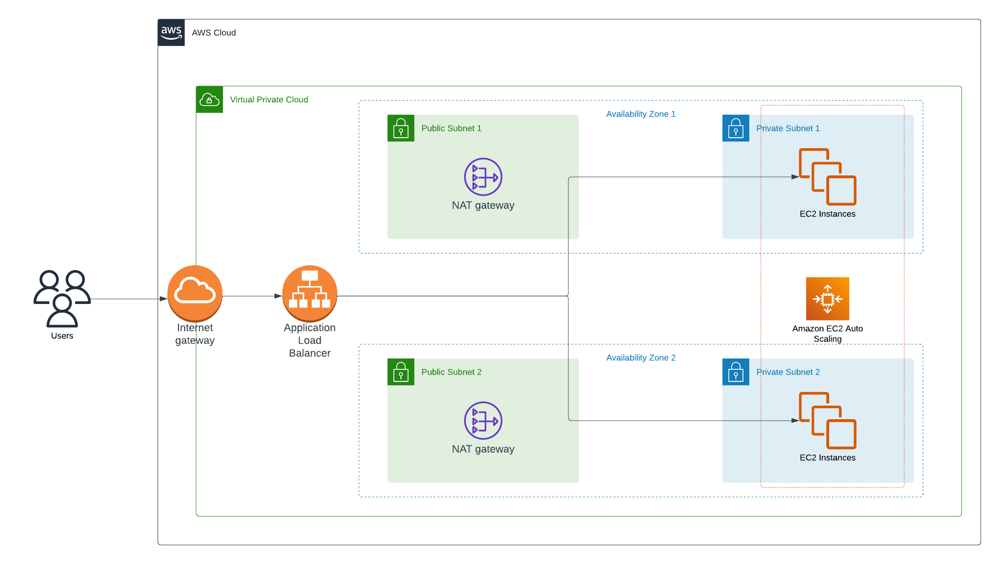

# High Availability Architecture

## Architecture Diagram

## Details
The goal of this architecture is to create an infrastructure that would serve user needs with high redundancy to avoid downtime.

To achieve this we would deploy across two availability zones (AZs). For security reasons, each Az will have a private and a public subnet, where web application servers will be placed in the private subnets that aren't publicly accessible. Instances in the private subnet can access the internet by routing their outbound requests to the NAT gateway in the public subnet which allows the instance to get updates, install dependencies, etc.

Using ec2 auto scaling helps in withstanding load and ensuring that there are enough instances. We create an auto scaling group across two AZs. We use a dynamic scaling policy to scale in or scale out based on the CPU utilization of the instances in the group. Traffic will be distributed across instances using elastic load balancer.
